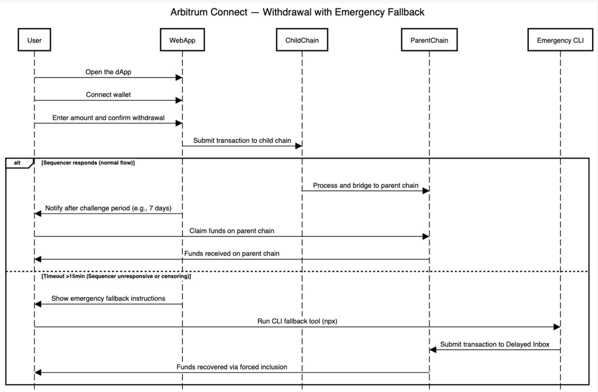

# 🧰 Arbitrum Connect — WakeUp Labs

Arbitrum Connect is a simple and secure one-way bridge that enables users to withdraw assets from child chain (e.g., Arbitrum) to parent chain (e.g., Ethereum) in the Arbitrum ecosystem (e.g., from Arbitrum to Ethereum).

Built by [WakeUp Labs](https://www.wakeuplabs.io/), this dApp simplifies the standard withdrawal process and introduces an emergency fallback mechanism to help users bypass the sequencer in cases of downtime or censorship.

## 🧪 Try It Out

You can try the live version of Arbitrum Connect (production environment supporting both mainnet and testnet):

**Production App:** [Arbitrum Connect](https://staging-arbitrum-connect-alt.wakeuplabs.link/)

This app is meant to guide you through a complete and safe withdrawal from child chain (e.g., Arbitrum) to parent chain (e.g., Ethereum) — and step in with support if things go wrong.

## Video Preview

[](https://youtu.be/a74U4romV-0?feature=shared)

> Check out the video preview of our dApp on [Youtube](https://youtu.be/a74U4romV-0?feature=shared).

## 🚀 Key Features

### One-Way Bridge

Withdraw assets from child chain (e.g., Arbitrum) to parent chain (e.g., Ethereum) through an intuitive web interface.

### Emergency Mode Support

If the sequencer is unavailable or censoring your transaction, the app will automatically detect the issue and guide you through an emergency CLI process to recover your funds.

### Non-custodial

You stay in control. All transactions are signed by your wallet — your private keys are never exposed.

### Open Source & Transparent

Released under the MIT license and open to contributors and community feedback.

## 🔍 How It Works

Arbitrum Connect operates in two modes depending on sequencer behavior:

### Normal Withdrawal Flow

1. Connect your wallet
2. Enter the withdrawal amount
3. Review estimated fees
4. Submit the transaction
5. Funds are bridged via the standard Arbitrum route and should appear on the parent chain (e.g., Ethereum) in a few minutes.

### 🚨 Emergency Mode: When the Sequencer Fails

If your withdrawal isn't confirmed within ~15 minutes, the dApp will switch to Emergency Mode and guide you to use a CLI tool to bypass the sequencer.

This fallback process uses Arbitrum's parent chain delayed inbox to recover your funds safely and trustlessly.

## Emergency Terminal Guide

[](https://www.npmjs.com/package/@wakeuplabs/arbitrum-connect)

**Requires:** Node.js v22.16.0+ and npm v10.9.2+

Check your versions:

```bash
node --version
npm --version
```

Run the emergency tool in your terminal:

```bash
npx @wakeuplabs/arbitrum-connect@latest
```

For more information about the emergency CLI tool, visit the [repository](https://github.com/wakeuplabs-io/arbitrum-connect-scripts).

Follow the prompts:

1. **Connect your wallet** — select or add your wallet
2. **Enter your private key** — must start with "0x"
3. **Initiate a new withdrawal** — follow the instructions to complete your request on the parent chain (e.g., Ethereum)

## 📊 Withdrawal Flow Diagram

The diagram below illustrates the normal and emergency withdrawal flows in Arbitrum Connect:



<!--
Editable diagram

title Arbitrum Connect — Withdrawal with Emergency Fallback

User->WebApp: Open the dApp
User->WebApp: Connect wallet
User->WebApp: Enter amount and confirm withdrawal

WebApp->ChildChain: Submit transaction to child chain

alt Sequencer responds (normal flow)
    ChildChain->ParentChain: Process and bridge to parent chain
    WebApp->User: Notify after challenge period (e.g., 7 days)
    User->ParentChain: Claim funds on parent chain
    ParentChain->User: Funds received on parent chain
else Timeout >15min (Sequencer unresponsive or censoring)
    WebApp->User: Show emergency fallback instructions
    User->Emergency CLI: Run CLI fallback tool (npx)
    Emergency CLI->ParentChain: Submit transaction to Delayed Inbox
    ParentChain->User: Funds recovered via forced inclusion
end
-->

### 💡 Included Flows

- ✅ **Normal flow** — Transaction is processed by the sequencer. After the challenge period, the user must manually claim funds on the parent chain.
- 🚨 **Emergency flow** — If the sequencer fails or censors the transaction, the CLI tool can force the transaction into the parent chain’s delayed inbox.

## 🛠️ For Contributors

We welcome contributors from the community! To run the project locally and contribute:

### Local Setup

**Requirements:**

- Node.js v18.18.2
- npm v9.8.1 (included with Node version above)

**Clone the Repository:**

```bash
git clone https://github.com/wakeuplabs-io/arbitrum-connect-alt.git
cd arbitrum-connect-alt
```

**Install Dependencies:**

```bash
npm install
```

**Start Local Server:**

```bash
npm run dev
```

Visit [http://localhost:3000](http://localhost:3000) to open the app in your browser.

## 🤝 Contributing

We follow standard GitHub contribution practices:

1. Fork the repo
2. Create a new branch for your changes
3. Make your updates
4. Open a pull request with a clear explanation

Please ensure your code is well-documented and tested before submitting.

## ❤️ About WakeUp Labs

Made with care by [WakeUp Labs](https://www.wakeuplabs.io/) — building tools that help bring decentralization to life, starting with accessibility and security for all.
